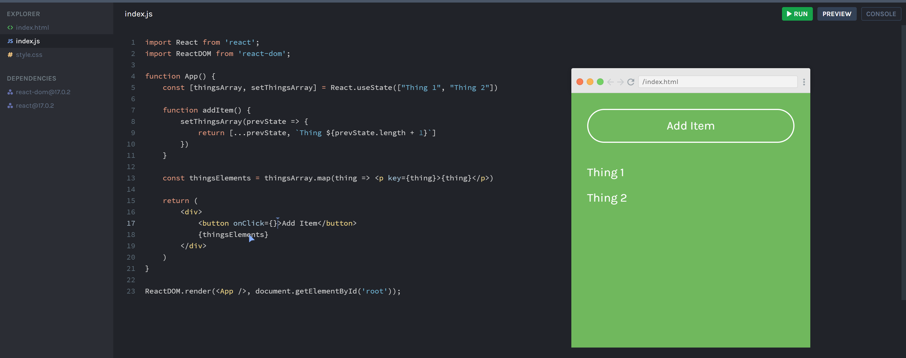
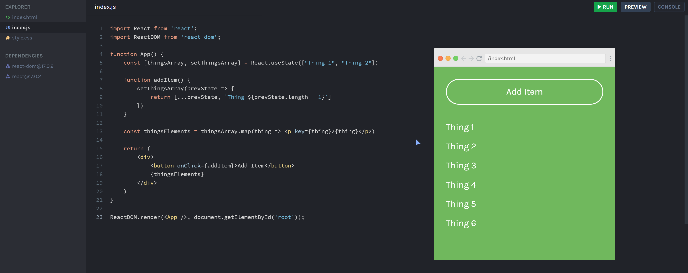

Quick start:

```
$ yarn # npm install
$ yarn build # npm run build
````

## Development

Run Webpack in watch-mode to continually compile the JavaScript as you work:

```
$ yarn watch # npm run watch
```

## Screenshots

<p align="center">
  
</p>

<p align="center">
  
</p>